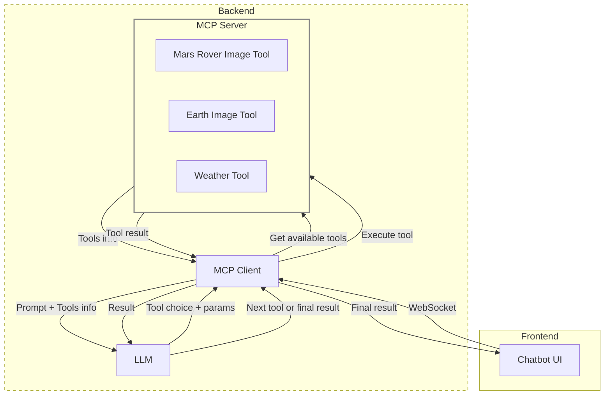

# MIE Chatbot

A lightweight and modern chat interface for MCP and LLM interactions with Markdown support!

## Overview

A minimalist chat interface built with React and TypeScript, designed to be easily integrated with any backend. Features a clean and modern design.


## Folder structure

```
MCP.postman_collection.json
README.md
frontend/
  ├── components.json
  ├── eslint.config.js
  ├── index.html
  ├── LICENSE
  ├── package.json
  ├── postcss.config.js
  ├── tailwind.config.js
  ├── tsconfig.app.json
  ├── tsconfig.app.tsbuildinfo
  ├── tsconfig.json
  ├── tsconfig.node.json
  ├── tsconfig.node.tsbuildinfo
  ├── vite.config.ts
  ├── public/
  │   └── integrations/
  │       └── integration.yaml
  ├── src/
  │   ├── App.css
  │   ├── App.tsx
  │   ├── index.css
  │   ├── integrationManager.ts
  │   ├── integrator.js
  │   ├── main.tsx
  │   ├── vite-env.d.ts
  │   ├── assets/
  │   │   └── fonts/
  │   │       ├── geist-mono.woff2
  │   │       └── geist.woff2
  │   ├── components/
  │   │   ├── custom/
  │   │   │   ├── actions.tsx
  │   │   │   ├── chatinput.tsx
  │   │   │   ├── header.tsx
  │   │   │   ├── icons.tsx
  │   │   │   ├── markdown.tsx
  │   │   │   ├── message.tsx
  │   │   │   ├── overview.tsx
  │   │   │   ├── sidebar.tsx
  │   │   │   ├── theme-toggle.tsx
  │   │   │   └── use-scroll-to-bottom.ts
  │   │   └── ui/
  │   │       ├── button.tsx
  │   │       ├── card.tsx
  │   │       ├── command.tsx
  │   │       ├── dialog.tsx
  │   │       ├── icons.tsx
  │   │       ├── input.tsx
  │   │       ├── label.tsx
  │   │       ├── popover.tsx
  │   │       ├── scroll-area.tsx
  │   │       └── textarea.tsx
  │   ├── context/
  │   │   └── ThemeContext.tsx
  │   ├── interfaces/
  │   │   └── interfaces.ts
  │   ├── lib/
  │   │   └── utils.ts
  │   ├── pages/
  │   │   └── chat/
  │   │       └── chat.tsx
  ├── testbackend/
  │   └── test.py
Screenshot/
  ├── image.png
  └── Mermaid_Chart.png
```

- The `frontend/` directory contains all the frontend code (React + TypeScript), configuration, and assets.
- The `src/` folder holds the main application source code, organized by components, context, interfaces, and utility functions.
- The `public/` directory is for static assets and integration configs.
- The `testbackend/` folder contains a simple backend for local testing.
- The `Screenshot/` folder contains images for documentation.

## YouTube Updates

| Description                                                       | YouTube Short                                                                  | Commit/PR                                                                                                   | Date                                                                                                                                                                                                                                                                       |
| ----------------------------------------------------------------- | ------------------------------------------------------------------------------ | ----------------------------------------------------------------------------------------------------------- | -------------------------------------------------------------------------------------------------------------------------------------------------------------------------------------------------------------------------------------------------------------------------- |
| Commit Mermaid diagram on the MCP Chatbot                         | [Watch](https://youtube.com/shorts/YSOqYVHAsjg)                                | [Commit](https://github.com/adithya1012/MIE_ChatBot/commit/b00f89d741af162aeba4b8f16b3669898979d265)        | [June 18](https://docs.google.com/document/d/1RGVLmfMQ1EpN2uXK2a6YLVcGXwu7ZrbIWCEe7AmRHBc/edit?pli=1&tab=t.0#heading=h.mrf11jp1gp4)                                                                                                                                        |
| Vite Learning                                                     | [Watch](https://youtube.com/shorts/EZeK7EcgFY4)                                | [PR](https://github.com/adithya1012/Learning/pull/1)                                                        | [June 17](https://docs.google.com/document/d/1RGVLmfMQ1EpN2uXK2a6YLVcGXwu7ZrbIWCEe7AmRHBc/edit?pli=1&tab=t.0#heading=h.f3pej13xvumg)                                                                                                                                       |
| MCP chatbot architecture and Clean up folder structure.           | [Watch](https://youtube.com/shorts/Ib9I8vepgPY)                                | [PR1](https://github.com/adithya1012/MIE_ChatBot/pull/18), [PR2](https://github.com/adithya1012/MCP/pull/1) | [June 14](https://docs.google.com/document/d/1RGVLmfMQ1EpN2uXK2a6YLVcGXwu7ZrbIWCEe7AmRHBc/edit?pli=1&tab=t.0#heading=h.8pcaemy93me2), [June 16](https://docs.google.com/document/d/1RGVLmfMQ1EpN2uXK2a6YLVcGXwu7ZrbIWCEe7AmRHBc/edit?pli=1&tab=t.0#heading=h.4kqr6yuqq850) |
| UI for MCP architecture demo                                      | [Watch](https://youtube.com/shorts/l_go1mo4wHY)                                |                                                                                                             |                                                                                                                                                                                                                                                                            |
| MCP backend API testing Postman                                   | [Watch](https://youtube.com/shorts/qY5o8yI-bZQ)                                |                                                                                                             |                                                                                                                                                                                                                                                                            |
| Simple CMD line interaction with MCP architecture.                | [Watch](https://youtube.com/shorts/3tGSEd2r8D0)                                |                                                                                                             |                                                                                                                                                                                                                                                                            |
| MCP - Inspector 🚓🚨                                              | [Watch](https://youtube.com/shorts/URPhnDYoKq4)                                |                                                                                                             |                                                                                                                                                                                                                                                                            |
| MCP client (TypeScript/Node) server (python) with🌡️ Weather tool. | [Watch](https://youtube.com/shorts/TJvB7dl9_8Y)                                |                                                                                                             |                                                                                                                                                                                                                                                                            |
| MCP architecture diagram                                          | [Watch](https://youtube.com/shorts/NlC0rGRSANQ)                                |                                                                                                             |                                                                                                                                                                                                                                                                            |
| VS code copilot MCP tool attachment in agent mode                 | [Watch](https://youtube.com/shorts/5t2vZ07zfus)                                |                                                                                                             |                                                                                                                                                                                                                                                                            |
| Simple MCP                                                        | [Watch](https://youtube.com/shorts/JYjJavez4Xo)                                |                                                                                                             |                                                                                                                                                                                                                                                                            |
| Mars Image API integration:                                       | [Watch](https://youtube.com/shorts/LMLNdOsZnFk)                                |                                                                                                             |                                                                                                                                                                                                                                                                            |
| Earth Image API integration:                                      | [Watch](https://youtube.com/shorts/WJMUf-ZXRyQ)                                |                                                                                                             |                                                                                                                                                                                                                                                                            |
| YAML File Integration                                             | [Watch](https://youtube.com/shorts/CovI4RM3zrg)                                |                                                                                                             |                                                                                                                                                                                                                                                                            |
| MultiTool Integration + Chat history                              | [Watch](https://youtube.com/shorts/J4uz3EOss80)                                |                                                                                                             |                                                                                                                                                                                                                                                                            |
| LLM Response Parsing (XML)                                        | [Watch](https://youtube.com/shorts/CCQt4RiIYJE)                                |                                                                                                             |                                                                                                                                                                                                                                                                            |
| Exploring NASA APIs                                               | [Watch](https://youtube.com/shorts/cBbhRo6dW5E)                                |                                                                                                             |                                                                                                                                                                                                                                                                            |
| Other                                                             | [Watch1](https://youtu.be/GklINnKCvQs), [Watch2](https://youtu.be/90mmfmDyxn8) |                                                                                                             |                                                                                                                                                                                                                                                                            |

## Getting Started

1. **Clone the repository**

```bash
git clone https://github.com/adithya1012/MIE_ChatBot.git
cd MIE_ChatBot/frontend
```

2. **Install dependencies**

```bash
npm install
```

3. **Start the development server**

```bash
npm run dev
```

The frontend will be available at [http://localhost:8501](http://localhost:8501) by default.

## Architecture

Below is the architecture diagram of the chatbot:



## Explanation

- **Frontend**: This repository contains the code for the chatbot frontend, built with TypeScript and React. Running `npm run dev` in the `frontend` directory will start the development server on port 8501. The frontend acts as a WebSocket client, maintaining a persistent connection with the backend for real-time chat functionality.

- **Backend**: The backend is not included in this repository. It is available in the [MCP repository](https://github.com/adithya1012/MCP). The backend implements a WebSocket server using the Model Context Protocol (MCP) architecture. You must run the backend separately to enable full chat functionality.

<!-- - **Integration**: The frontend is designed to be easily integrated with any backend that supports WebSocket and the MCP protocol. You can modify the integration configuration in `frontend/public/integrations/integration.yaml` as needed. -->
