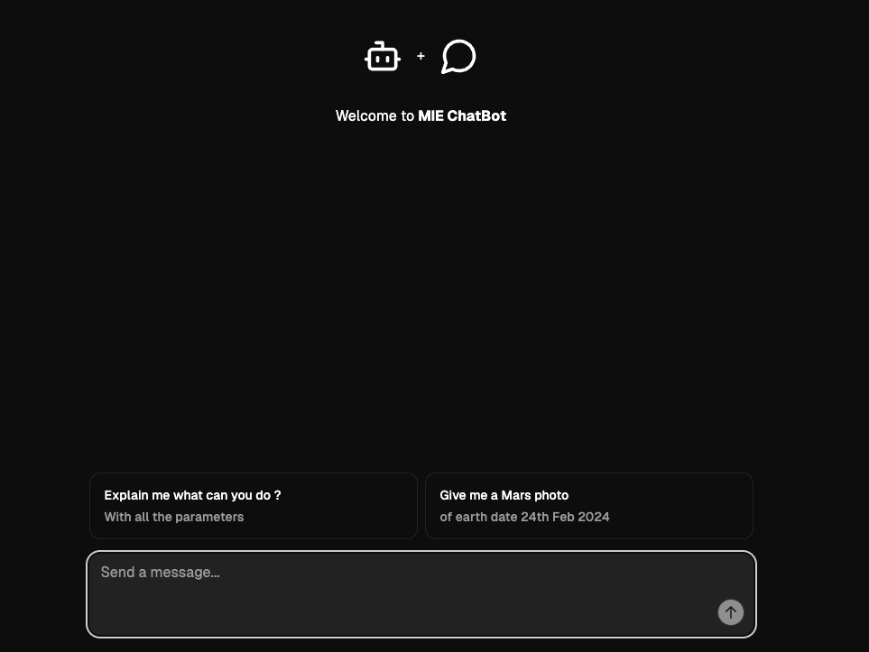
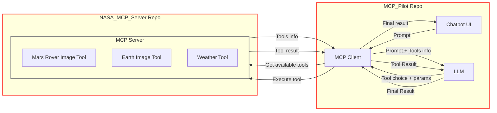

# MCP Pilot

A lightweight and modern chat interface for MCP and LLM interactions with Markdown support!

## Overview

A minimalist chat interface built with React and TypeScript, designed to be easily integrated with any backend. Features a clean and modern design.



## Project structure

```
├── Chatbot_ui
│   ├── LICENSE
│   ├── components.json
│   ├── eslint.config.js
│   ├── index.html
│   ├── package-lock.json
│   ├── package.json
│   ├── postcss.config.js
│   ├── public
│   │   └── integrations
│   │       └── integration.yaml
│   ├── src
│   │   ├── App.css
│   │   ├── App.tsx
│   │   ├── components
│   │   │   ├── custom
│   │   │   │   ├── actions.tsx
│   │   │   │   ├── chatinput.tsx
│   │   │   │   ├── header.tsx
│   │   │   │   ├── icons.tsx
│   │   │   │   ├── markdown.tsx
│   │   │   │   ├── message.tsx
│   │   │   │   ├── overview.tsx
│   │   │   │   ├── sidebar.tsx
│   │   │   │   ├── theme-toggle.tsx
│   │   │   │   └── use-scroll-to-bottom.ts
│   │   │   └── ui
│   │   │       ├── button.tsx
│   │   │       ├── card.tsx
│   │   │       ├── command.tsx
│   │   │       ├── dialog.tsx
│   │   │       ├── icons.tsx
│   │   │       ├── input.tsx
│   │   │       ├── label.tsx
│   │   │       ├── popover.tsx
│   │   │       ├── scroll-area.tsx
│   │   │       └── textarea.tsx
│   │   ├── context
│   │   │   └── ThemeContext.tsx
│   │   ├── index.css
│   │   ├── integrationManager.ts
│   │   ├── integrator.js
│   │   ├── interfaces
│   │   │   └── interfaces.ts
│   │   ├── lib
│   │   │   └── utils.ts
│   │   ├── main.tsx
│   │   ├── pages
│   │   │   └── chat
│   │   │       └── chat.tsx
│   │   └── vite-env.d.ts
│   ├── tailwind.config.js
│   ├── testbackend
│   │   └── test.py
│   ├── tsconfig.app.json
│   ├── tsconfig.app.tsbuildinfo
│   ├── tsconfig.json
│   ├── tsconfig.node.json
│   ├── tsconfig.node.tsbuildinfo
│   └── vite.config.ts
├── MCP.postman_collection.json
├── MCP_client
│   ├── build
│   │   ├── index.js
│   │   ├── mcpClientManager.js
│   │   └── server.js
│   ├── package-lock.json
│   ├── package.json
│   ├── src
│   │   ├── index.ts
│   │   ├── mcpClientManager.ts
│   │   └── server.ts
│   └── tsconfig.json
├── README.md
└── Screenshot
    ├── Mermaid_Chart.png
    └── image.png
```

- The `Chatbot_ui/` directory contains all the frontend code (React + TypeScript), configuration, and assets.
- The `MCP_client/` directory contains the MCP Client, which manages communication with the MCP server and LLM providers.
- The `Screenshot/` folder contains images for documentation.

## Architecture

Below is the architecture diagram of the chatbot:



## YouTube Updates

| Description                                                       | YouTube Short                                                                  | Commit/PR                                                                                                   | Date                                                                                                                                                                                                                                                                       |
| ----------------------------------------------------------------- | ------------------------------------------------------------------------------ | ----------------------------------------------------------------------------------------------------------- | -------------------------------------------------------------------------------------------------------------------------------------------------------------------------------------------------------------------------------------------------------------------------- |
| Commit Mermaid diagram on the MCP Chatbot                         | [Watch](https://youtube.com/shorts/YSOqYVHAsjg)                                | [Commit](https://github.com/adithya1012/MIE_ChatBot/commit/b00f89d741af162aeba4b8f16b3669898979d265)        | [June 18](https://docs.google.com/document/d/1RGVLmfMQ1EpN2uXK2a6YLVcGXwu7ZrbIWCEe7AmRHBc/edit?pli=1&tab=t.0#heading=h.mrf11jp1gp4)                                                                                                                                        |
| Vite Learning                                                     | [Watch](https://youtube.com/shorts/EZeK7EcgFY4)                                | [PR](https://github.com/adithya1012/Learning/pull/1)                                                        | [June 17](https://docs.google.com/document/d/1RGVLmfMQ1EpN2uXK2a6YLVcGXwu7ZrbIWCEe7AmRHBc/edit?pli=1&tab=t.0#heading=h.f3pej13xvumg)                                                                                                                                       |
| MCP chatbot architecture and Clean up folder structure.           | [Watch](https://youtube.com/shorts/Ib9I8vepgPY)                                | [PR1](https://github.com/adithya1012/MIE_ChatBot/pull/18), [PR2](https://github.com/adithya1012/MCP/pull/1) | [June 14](https://docs.google.com/document/d/1RGVLmfMQ1EpN2uXK2a6YLVcGXwu7ZrbIWCEe7AmRHBc/edit?pli=1&tab=t.0#heading=h.8pcaemy93me2), [June 16](https://docs.google.com/document/d/1RGVLmfMQ1EpN2uXK2a6YLVcGXwu7ZrbIWCEe7AmRHBc/edit?pli=1&tab=t.0#heading=h.4kqr6yuqq850) |
| UI for MCP architecture demo                                      | [Watch](https://youtube.com/shorts/l_go1mo4wHY)                                |                                                                                                             |                                                                                                                                                                                                                                                                            |
| MCP backend API testing Postman                                   | [Watch](https://youtube.com/shorts/qY5o8yI-bZQ)                                |                                                                                                             |                                                                                                                                                                                                                                                                            |
| Simple CMD line interaction with MCP architecture.                | [Watch](https://youtube.com/shorts/3tGSEd2r8D0)                                |                                                                                                             |                                                                                                                                                                                                                                                                            |
| MCP - Inspector 🚓🚨                                              | [Watch](https://youtube.com/shorts/URPhnDYoKq4)                                |                                                                                                             |                                                                                                                                                                                                                                                                            |
| MCP client (TypeScript/Node) server (python) with🌡️ Weather tool. | [Watch](https://youtube.com/shorts/TJvB7dl9_8Y)                                |                                                                                                             |                                                                                                                                                                                                                                                                            |
| MCP architecture diagram                                          | [Watch](https://youtube.com/shorts/NlC0rGRSANQ)                                |                                                                                                             |                                                                                                                                                                                                                                                                            |
| VS code copilot MCP tool attachment in agent mode                 | [Watch](https://youtube.com/shorts/5t2vZ07zfus)                                |                                                                                                             |                                                                                                                                                                                                                                                                            |
| Simple MCP                                                        | [Watch](https://youtube.com/shorts/JYjJavez4Xo)                                |                                                                                                             |                                                                                                                                                                                                                                                                            |
| Mars Image API integration:                                       | [Watch](https://youtube.com/shorts/LMLNdOsZnFk)                                |                                                                                                             |                                                                                                                                                                                                                                                                            |
| Earth Image API integration:                                      | [Watch](https://youtube.com/shorts/WJMUf-ZXRyQ)                                |                                                                                                             |                                                                                                                                                                                                                                                                            |
| YAML File Integration                                             | [Watch](https://youtube.com/shorts/CovI4RM3zrg)                                |                                                                                                             |                                                                                                                                                                                                                                                                            |
| MultiTool Integration + Chat history                              | [Watch](https://youtube.com/shorts/J4uz3EOss80)                                |                                                                                                             |                                                                                                                                                                                                                                                                            |
| LLM Response Parsing (XML)                                        | [Watch](https://youtube.com/shorts/CCQt4RiIYJE)                                |                                                                                                             |                                                                                                                                                                                                                                                                            |
| Exploring NASA APIs                                               | [Watch](https://youtube.com/shorts/cBbhRo6dW5E)                                |                                                                                                             |                                                                                                                                                                                                                                                                            |
| Other                                                             | [Watch1](https://youtu.be/GklINnKCvQs), [Watch2](https://youtu.be/90mmfmDyxn8) |                                                                                                             |                                                                                                                                                                                                                                                                            |

## Setup Instructions

### 1. Setup and run the Chatbot UI

```bash
cd Chatbot_ui
npm install
npm run dev
```

The frontend will be available at [http://localhost:8501](http://localhost:8501) by default.

### 2. Setup and run the MCP Client

```bash
cd MCP_client
npm install
npm run dev
```

### 3. Environment Variables

Create a `.env` file in the `MCP_client` directory and add your API keys:

```
OPENAI_API_KEY=your_openai_api_key_here
ANTHROPIC_API_KEY=your_anthropic_api_key_here
```

### 4. Update MCP Configuration

The MCP Client configuration is currently hardcoded to use the following server URL:

```ts
const mcpConfig: MCPClientConfig = {
  serverUrl: "http://127.0.0.1:8000/mcp",
  provider: "openai",
};
```

Update this if your MCP server runs on a different URL.

---

## Usage

### WebSocket Connection

- Connect to the WebSocket server at:  
  `ws://localhost:8090`
- Send messages as JSON:
  ```json
  {
    "query": "What is the weather like today?"
  }
  ```
- Or send plain text messages directly.

### HTTP API

- **Health Check:**  
  `GET http://localhost:3000/health`

- **Execute Query:**  
  `POST http://localhost:3000/mcp/execute`  
  Content-Type: application/json

  ```json
  {
    "message": "Your question here"
  }
  ```

- **Check MCP Status:**  
  `GET http://localhost:3000/mcp/status`

---

## Features

- **WebSocket Server:** Real-time communication on port 8090
- **HTTP REST API:** HTTP endpoints on port 3000
- **MCP Integration:** Seamless tool calling through MCP protocol
- **Multi-Provider Support:** Both OpenAI and Claude support
- **Error Handling:** Comprehensive error handling and logging
- **Message Queuing:** Queues messages when MCP client is initializing

---

## Explanation

- **Frontend**: The `Chatbot_ui` directory contains the code for the chatbot frontend, built with TypeScript and React. Running `npm run dev` in this directory will start the development server on port 8501. The frontend acts as a WebSocket client, maintaining a persistent connection with the backend for real-time chat functionality.

- **MCP Client**: The `MCP_client` directory contains the MCP Client, which manages communication with the MCP server and LLM providers (OpenAI, Claude). It exposes both WebSocket (port 8090) and HTTP REST API (port 3000) interfaces for client communication.

- **Backend**: The backend MCP server is not included in this repository. It is available in the [NASA MCP Server repository](https://github.com/adithya1012/NASA-MCP-Server). You must run the backend separately to enable full chat functionality.

---

## Troubleshooting

### Common Issues

- **MCP Client not ready:** Ensure your MCP server path is correct and the Python environment is set up properly.
- **API Key errors:** Make sure your `.env` file contains valid API keys for your chosen provider.
- **Connection errors:** Check that your MCP server script exists and is executable.
- **Port conflicts:** Ensure ports 8090 and 3000 are available.

### Debug Logs

The server provides comprehensive logging. Check the console output for detailed error messages and connection status.

---
